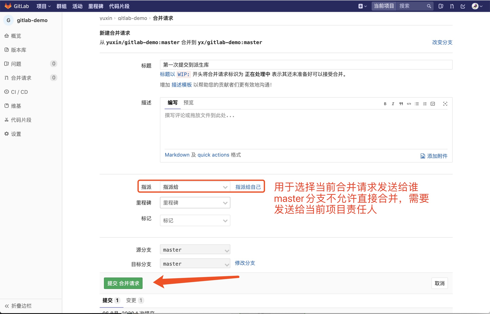

**
中科云谷gatLab操作手册
**

1. 创建派生库(派生就是基于主库分化,类似于主分支和分支)

2. 将派生库clone到本地
> `git clone http://gitlab.zoomlion.com/yuxin/gitlab-demo.git`

3. 本地库关联主库
> `git remote add upstream http://gitlab.zoomlion.com/yx/gitlab-demo.git`

4. 将主库文件更新到本地(可能有其它同学更新内容合并到主库,所有合并操作前先将主库内容更新一下)
> `git pull upstream master`

5. 然后再将文件修改后先推送到派生库
>`git status`  
> `git add .`  
> `git commit -m '提交内容'`  
> `git push origin master`  

6. 在派生库中发起合并申请,并选择需要合并的分支

7. 等待主库管理员同意合并,同意后则完成合并请求 

8. 将合并变更信息更新到本地并推送到派生库
> `git pull upstream master`  
> `git push origin master`  

附图: git常用操作命令

